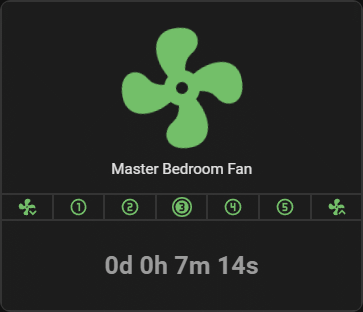

# Timer Card

[](https://github.com/wwwescape/timer-card/releases)
[](https://github.com/wwwescape/timer-card/commits/master)
[](https://github.com/wwwescape/timer-card)
[](https://github.com/hacs/default)
[](https://codecov.io/gh/wwwescape/timer-card/)
[](https://www.codefactor.io/repository/github/wwwescape/timer-card)


Display a simple timer.

Based on the [Countdown card type](https://github.com/marcokreeft87/formulaone-card#countdown) from [marcokreeft87](https://github.com/marcokreeft87)'s fantastic [FormulaOne Card](https://github.com/marcokreeft87/formulaone-card).



## Installation


### Manual install
1. Navigate to your `<config>/www/` folder inside your Home Assistant installation and create a new folder named `timer-card`.
2. Manually download [timer-card.js](https://raw.githubusercontent.com/wwwescape/timer-card/main/timer-card.js).
3. Place the file inside the `timer-card` folder you created in step 1.
4. Add the following to your `configuration.yaml` file:
  ```yaml
  lovelace:
    resources:
      - url: /local/timer-card/timer-card.js
        type: module
  ```
4. Alternately, go to `Settings` -> `Dashboards`. Then in the top right corner, click the 3 dots icon and click `Resources`. Click the `+ Add Resource` button in the bottom right corner. Add `/local/timer-card/timer-card.js` as the `URL` and choose `JavaScript Module` as the `Resource Type`. Click `Create`.
5. Finally, refresh your browser window.


## Configuration

| Name              | Type          | Default                               | Description                                                                                                                     |
| ----------------- | ------------- | ------------------------------------- | ------------------------------------------------------------------------------------------------------------------------------- |
| type              | string        | **Required**                          | `custom:timer-card`                                                                                                             |
| title             | string        |                                       | The header of the card (hidden when null or empty)                                                                              |
| date              | string        | **Required (if entity) not defined**  | The date to use for the timer (should be a valid [ISO 8601](https://en.wikipedia.org/wiki/ISO_8601) date string)                |
| entity            | string        | **Required (if date) not defined**    | The entity to use for the timer (entity state should be a valid date)                                                           |
| reverse           | boolean       | `false`                               | Set to `true` to show elapsed time                                                                                              |
| translations      | dictionary    |  _[translations](#Translations)_      | Dictionary to override the default translation                                                                                  |

**Note:** If both `date` and `entity` are defined, `date` will be used.

## Example configurations

### Countdown

```yaml
type: custom:timer-card
title: Countdown
date: 2024-01-01T00:00:00Z
```

### Time elapsed

```yaml
type: custom:timer-card
title: Time Elapsed
entity: input_datetime.my_datetime
reverse: true
```

## Translations

The following texts can be translated or altered.

| Key                 | Default value         |
| ------------------- | --------------------- |
| days                | d                     |
| hours               | h                     |
| minutes             | m                     |
| seconds             | s                     |
| timer_complete      | 'Timer Completed'     |
| timer_not_started   | 'Timer Not Started'   |

Example:

```yaml
type: custom:timer-card
title: Countdown
date: 2023-01-01T00:00:00Z
translations: 
  'timer_complete' : 'Countdown Done'  
```


## TODO
- [ ] Clean up code
- [ ] Add more tests